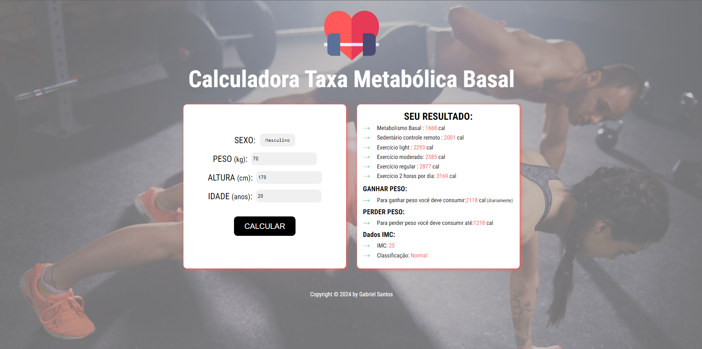

<h1 align="center">Projeto Calcular IMC 🏋🏻‍♀️</h1>

<h4 align="center"><a href="https://myportfolio-gabriel-santos.netlify.app/">Confira o projeto aqui</a></h4>

# Calculadora Índice de Massa corporal - Calorias

- 1 - Entre o peso
- 2 - Entre a altura
- 3 - Indice de massa corporal = peso / altura²

# Calculadora de Taxa Metabólica Basal

- 0 - idade
- 1 - peso
- 2 - altura
- 3 - taxa do exercício
- 4 - sexo (masculino x feminino)

## 😎 Sobre

Projeto feito no intuito de calcular a taxa de IMC.

## 🧠 Tecnologias utilizadas:

    
    
    

